# Booky — Library Web App

[](https://github.com/Yusuf-98/Library-Web-App/actions/workflows/ci.yml)

A web app for borrowing books online: browse the catalogue, add books to a cart, check out with a borrow date and duration, and track loans and reviews. Admins manage books, users and loan returns from a separate dashboard.

Built with React, TypeScript and Vite against a separate REST API. The interface is aimed at an Indonesian audience, so a few labels (for example the phone number field) are in Indonesian.

🚀 **Live demo:** https://library-web-by-yusuf.vercel.app/

To try the reader flow (cart, checkout, loans, reviews), create an account on the Register page. The admin dashboard needs a privileged account, so it is shown in the screenshots below instead.

<p align="center">
  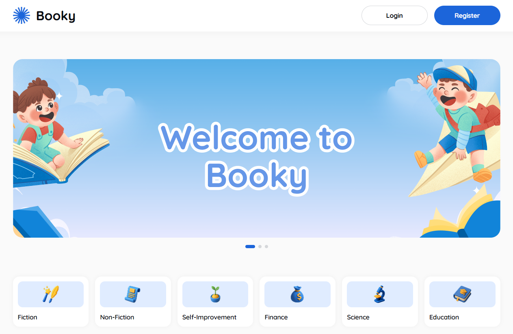
</p>


## Features

**Readers**
- Register with instant form validation, and log in
- Browse the catalogue by category, author or debounced search, with category and rating filters
- Book detail page with stock, rating, reviews and related books
- Cart and checkout: pick a borrow date and a 3, 5 or 10 day duration; the return date is calculated for you
- "My Loans" list filtered by status (All, Active, Returned, Overdue)
- Write, edit and delete reviews; manage your profile

**Admins**
- Book management: add, edit, preview and delete books with cover upload
- User list and search
- Loan list with status filters and a "Mark Returned" action

Access is split into three levels in [src/App.tsx](src/App.tsx): public pages, pages that need a login (`ProtectedRoute`) and admin-only pages (`AdminRoute`).

## Screenshots

| | |
| --- | --- |
| 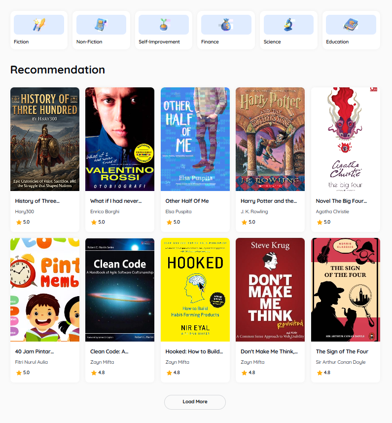 | 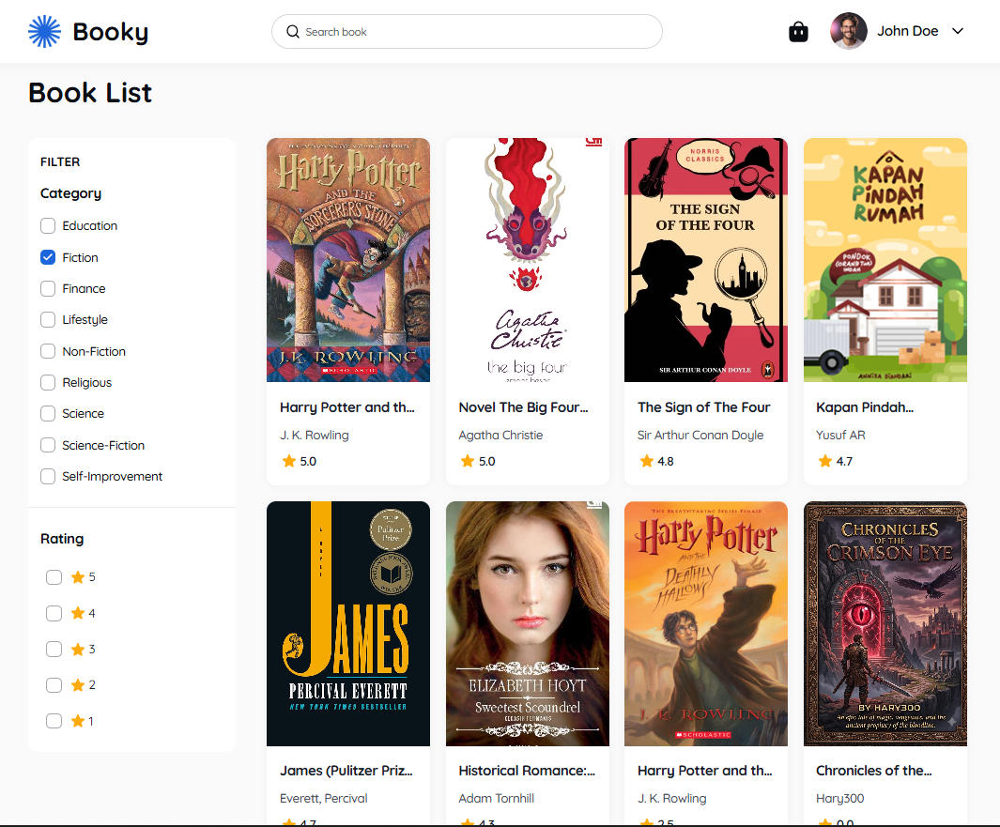 |
| **Home** — recommendations with "Load More" | **Book list** — category and rating filters |
| 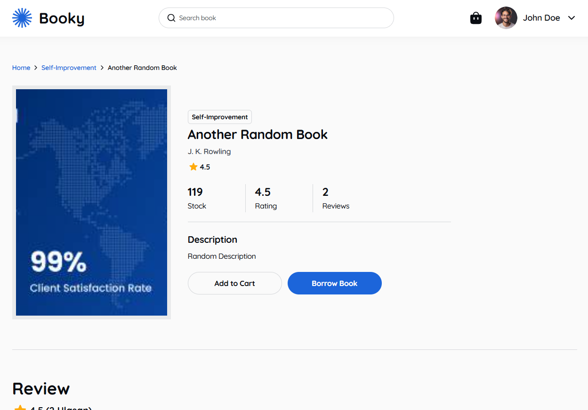 | 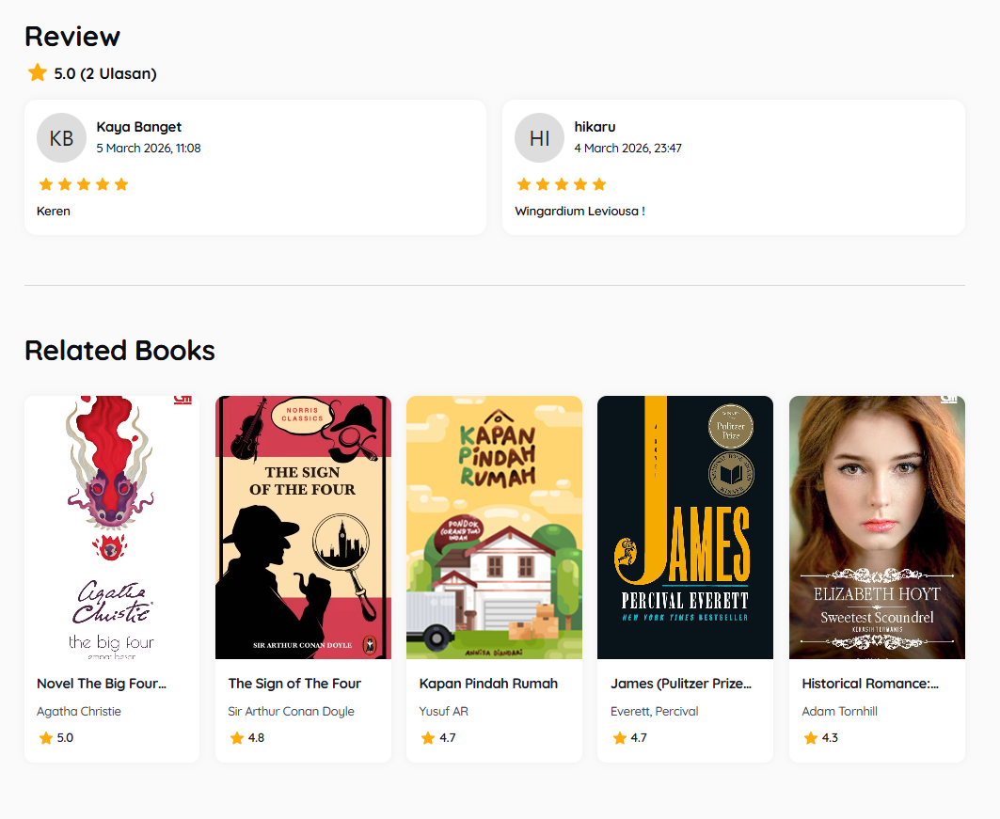 |
| **Book detail** — stock, rating, add to cart or borrow | **Reviews and related books** |
| 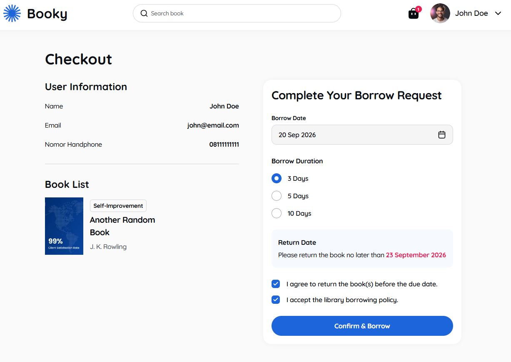 | 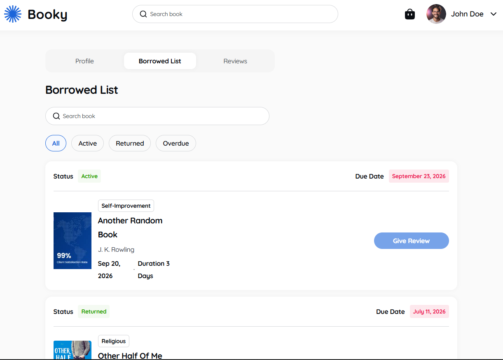 |
| **Checkout** — borrow date, duration and computed return date | **My loans** — filter by status |
| 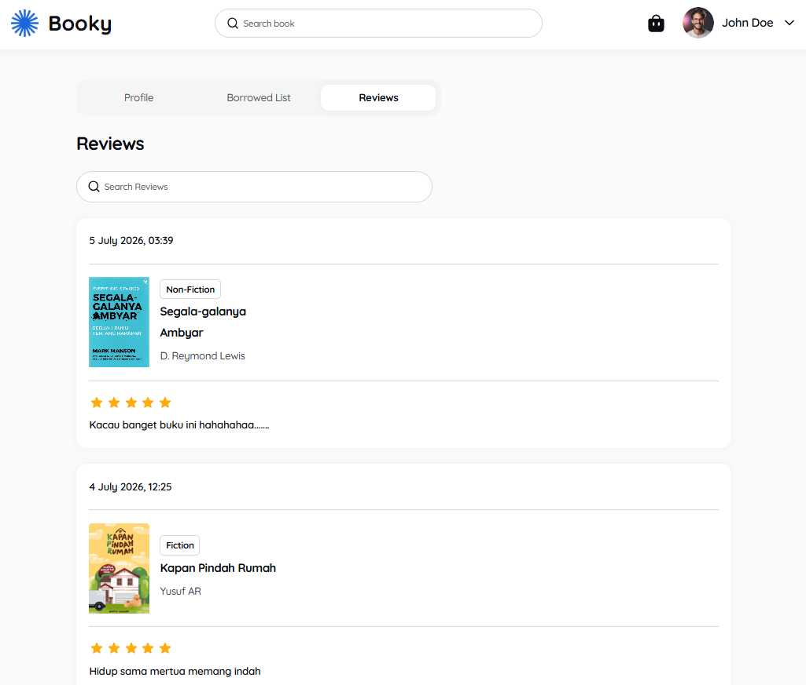 | 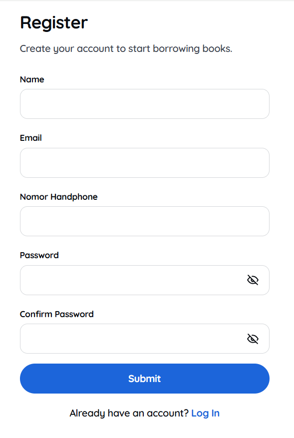 |
| **My reviews** | **Register** |

### Admin dashboard

| | |
| --- | --- |
| 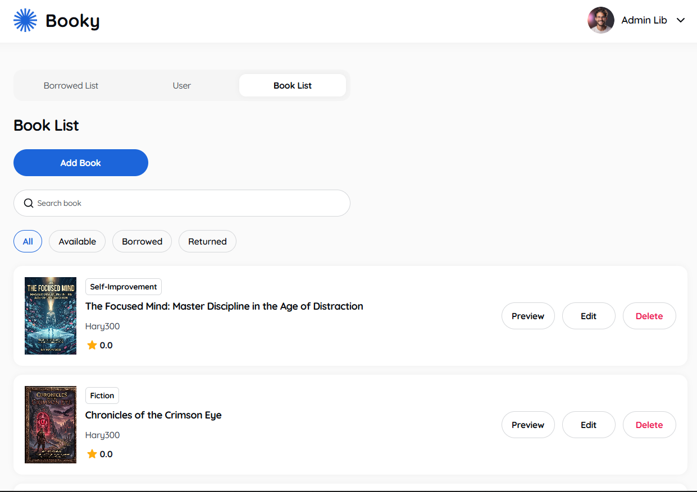 | 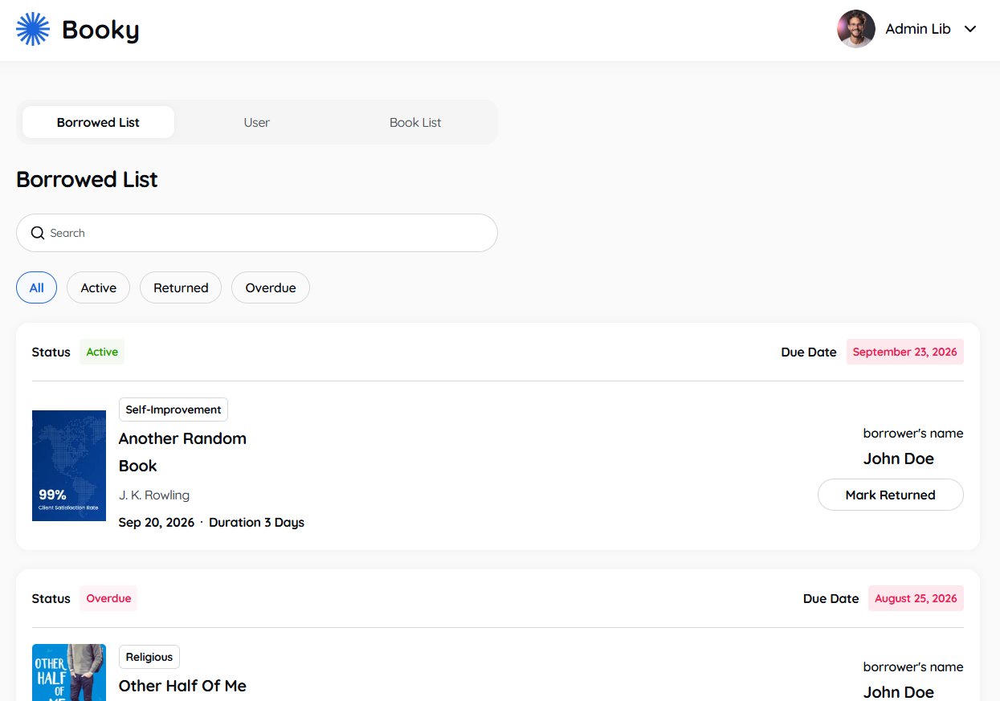 |
| **Books** — preview, edit, delete | **Loans** — mark as returned |

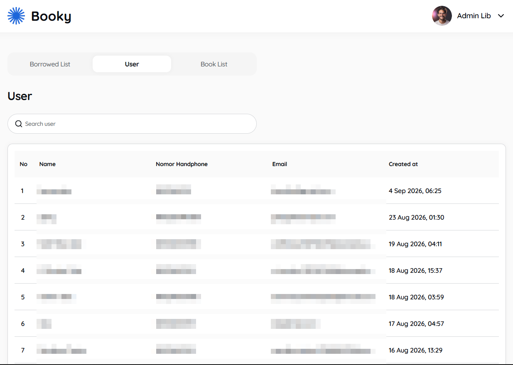

*Personal details of the users in this list are pixelated.*

## Tech stack

- **React 19** + **TypeScript** + **Vite**
- **TanStack Query** for server state (fetching, caching, mutations)
- **Redux Toolkit** for auth and UI state
- **React Router** for routing, with route-level code splitting
- **Tailwind CSS v4** + **Radix UI** (shadcn/ui) for styling and accessible primitives
- **Axios** for the API client
- **Vitest** + **React Testing Library** for tests, **GitHub Actions** for CI

## Getting started

Requires Node.js 22.12 or newer.

```bash
git clone https://github.com/Yusuf-98/Library-Web-App.git
cd Library-Web-App
npm install
cp .env.example .env
```

Fill in the backend URL in `.env`:

| Variable | Description |
| --- | --- |
| `VITE_API_URL` | Base URL of the backend REST API, without a trailing slash (for example `https://your-backend-host/api`) |

Then start the dev server and open `http://localhost:5173`:

```bash
npm run dev
```

The dev server fails fast if port 5173 is taken. Set the `PORT` environment variable to use another one.

| Command | Description |
| --- | --- |
| `npm run dev` | Start the Vite dev server |
| `npm run build` | Type-check (`tsc -b`) and build for production |
| `npm run lint` | Run ESLint |
| `npm run typecheck` | Type-check only |
| `npm test` | Run the test suite once |
| `npm run test:watch` | Run tests in watch mode |
| `npm run preview` | Preview the production build |

## Testing

Tests live next to the code they cover (`*.test.ts` / `*.test.tsx`) and run with Vitest and React Testing Library in jsdom. They target interactive logic rather than static markup:

- **Dates and timezones**: the default borrow date and the return date are checked in Toronto, Los Angeles, Jakarta and UTC, including US daylight-saving changes and leap years.
- **Borrow form**: default and minimum date, return-date recalculation, agreement gating and the payload sent on submit.
- **Search overlay**: results, empty and error states, Escape to close, scroll lock, and closing when a result is opened.
- **Accessibility**: the tabs (roving tabindex, arrow/Home/End keys, tabpanel wiring), the overlay hook (focus return) and the filter checkboxes.
- **Forms and search**: the registration rules and the full Register flow (field errors, focus, trimmed values, server errors), the Login flow (admin redirect, refused credentials), and the debounced search hooks (one request once typing pauses; a new search restarts at page 1).
- **Checkout logic**: `useBorrowMutation` (optimistic cart and stock update, rollback on failure, partial failures, success redirect) and the Cart page (selection, Select All, removal by cart item id).
- **Access control**: `ProtectedRoute` and `AdminRoute`, including an exact-match check on the `ADMIN` role.
- **Home page**: loading skeletons, paging through categories, "Load More", error and empty states.
- **API contract**: every function in `src/lib/api` is checked for the path, method, query string, body and envelope part it sends and returns.
- **Resilience**: the error boundary fallback, "not found" versus generic error states on the book and author pages, the API client (status-preserving errors, Bearer token, 401 logout) and the retry policy (4xx answers are not retried).
- **Admin forms**: the cover-image controls in the book form.

GitHub Actions runs lint, type-check, tests and the production build on every push and pull request ([ci.yml](.github/workflows/ci.yml)).

## Performance

- **Cover images** are requested from Cloudinary at about twice their displayed size in a modern format (`f_auto,q_auto,c_limit`), and lazy-loaded below the fold. A 2.2 MB cover becomes about 35 KB.
- **Hero banner** is a responsive WebP (`srcset` for narrow and wide screens) with `fetchpriority="high"` and declared dimensions.
- **Loading skeletons** have exactly the same box model as the cards they stand in for, so nothing shifts when data arrives (Cumulative Layout Shift of 0 on the home page).
- **Requests** are kept lean: search is debounced, 4xx answers are not retried, and routes are code-split.

## API

The app talks to a separate REST API (Express, Prisma and PostgreSQL). It publishes no OpenAPI/Swagger document, so the contract this frontend relies on is summarised here. Paths are relative to `VITE_API_URL`.

- **Envelope**: responses are `{ success, message, data }`. The Axios client unwraps `data` and turns `success: false` into an error; error responses carry a `message` that the UI shows.
- **Auth**: `POST /auth/login` returns `{ token, user }` and the token is sent as `Authorization: Bearer <token>`. `POST /auth/register` returns only the created user, so the app logs in right after. A `401` logs the user out. Roles are `USER` and `ADMIN`; admin routes answer `403` to a normal user.
- **Pagination**: lists take `page` and `limit`; the catalogue and loan endpoints cap `limit` at 50.

| Area | Endpoints used |
| --- | --- |
| Catalogue | `GET /books` (`q`, `categoryId`, `authorId`, `minRating`), `GET /books/:id`, `GET /categories`, `GET /authors/popular`, `GET /authors/:id/books` |
| Cart and checkout | `GET /cart`, `POST /cart/items`, `DELETE /cart/items/:id`, `GET /cart/checkout`, `POST /loans/from-cart` |
| Loans | `GET /loans/my` (`status`: `all`, `active`, `returned`, `overdue`; `q`), `POST /loans` |
| Reviews | `GET /reviews/book/:id`, `POST /reviews`, `DELETE /reviews/:id`, `GET /me/reviews` |
| Profile | `GET /me`, `PATCH /me` |
| Admin | `GET /admin/books`, `GET /admin/users`, `GET /admin/loans`, `PATCH /admin/loans/:id`, `POST /books`, `PUT /books/:id`, `DELETE /books/:id` |

Reviews are only accepted for books the user has borrowed and returned. There is no update route for reviews: editing one sends `POST /reviews` again for the same book.

## Project structure

```
src/
├── app/            # Redux store and typed hooks
├── components/
│   ├── admin/      # Admin-only components
│   ├── common/     # Reusable cards and detail views
│   ├── layouts/    # Layout shells (user, admin, account)
│   ├── sections/   # Page-specific blocks (home, checkout, book detail, ...)
│   ├── shared/     # Navbar, footer, route guards, search overlay
│   └── ui/         # UI primitives (shadcn/ui on Radix)
├── features/       # Per-domain state and data hooks: auth, ui, cart, checkout, profile, reviews
├── hooks/          # Generic hooks (useDebouncedValue, usePagedSearch, useRovingTabs, useOverlayA11y, ...)
├── lib/
│   ├── api/        # REST calls grouped by resource
│   ├── queryKeys.ts  # Centralised TanStack Query keys
│   └── ...         # Axios instance, utils, category icons
├── pages/
│   ├── user/       # Reader pages
│   └── admin/      # Admin pages
├── test/           # Vitest setup (jsdom stubs)
└── types/          # Shared types (Book, User, Loan, Review, ...)
```

## Deployment

Deployed on Vercel. [vercel.json](vercel.json) rewrites every path to `index.html` so direct links and page refreshes work with client-side routing. Set `VITE_API_URL` in the Vercel project's environment variables.

## Author

Built by [Yusuf AR](https://github.com/Yusuf-98).

## License

Licensed under the [MIT License](LICENSE).
